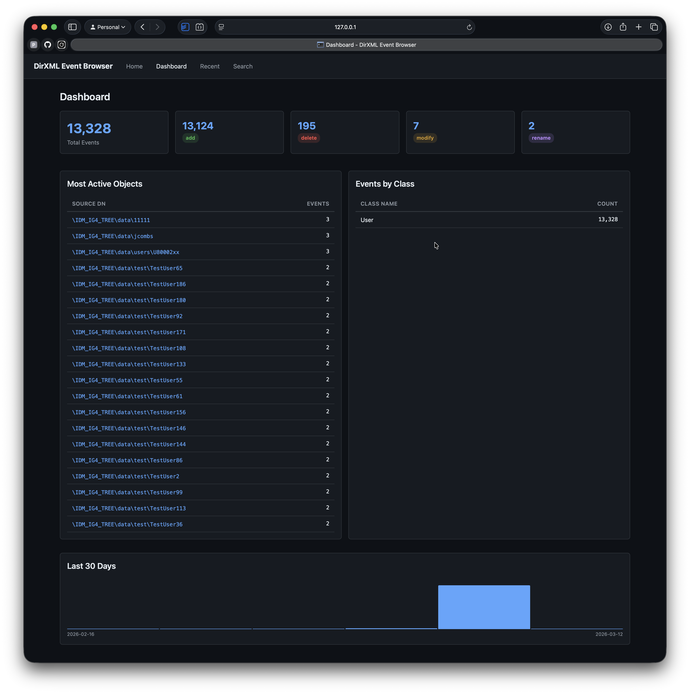
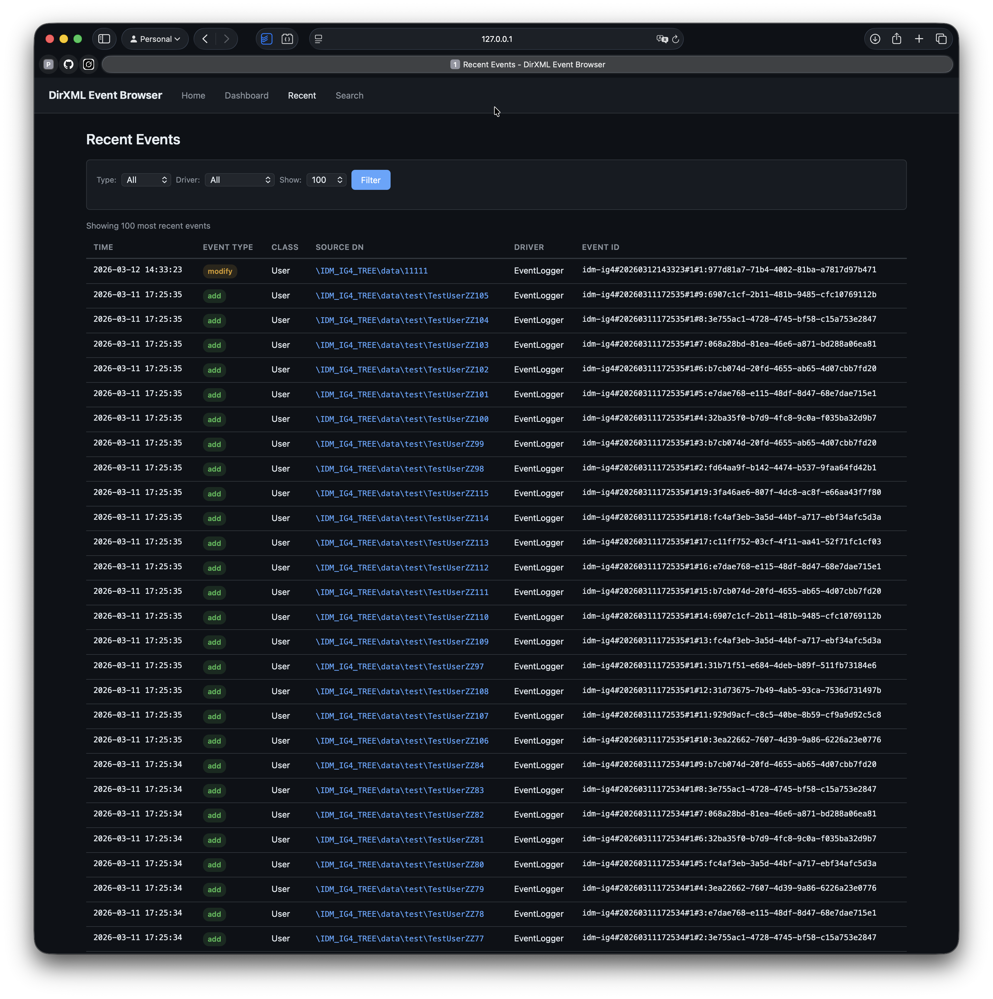

# DirXML Event Logger

A NetIQ Identity Manager driver that captures events from the subscriber channel and logs them to a PostgreSQL database, along with a Flask web UI for browsing and forensic analysis. While it may be useful, this is not a comprehensive auditing solution. It is very useful during driver development as it can capture sample events to be used for testing.

## Overview

The Event Logger driver sits on the subscriber channel of an Identity Manager driver set. Every event that passes through (add, modify, delete, sync, rename, move) is converted to JSON and written to a PostgreSQL table alongside the original XML. This gives you a searchable, queryable audit trail of all identity events.

The companion web UI provides a forensic investigation interface: search for any object by DN and see a complete timeline of every event that affected it, with diff views for modify events showing exactly what changed.





## Components

```
src/com/pointblue/idm/eventlogger/
  EventLoggerDriver.java     Main driver class (DriverShim, SubscriptionShim, PublicationShim)
  CommonImpl.java             Base class with XDS document utilities
  PolicyLogger.java           Standalone logger for policy input/output documents
  xds2json/
    BaseEventConverter.java   Abstract base for all XML-to-JSON converters
    AddEventConverter.java    Handles <add> events
    ModifyEventConverter.java Handles <modify> events
    DeleteEventConverter.java Handles <delete> events
    SyncEventConverter.java   Handles <sync> events
    RenameEventConverter.java Handles <rename> events
    MoveEventConverter.java   Handles <move> events
    JsonToXmlConverter.java   Reverse converter (JSON back to XML)
  offline/                    Test harnesses for offline development
web/
  app.py                      Flask web application
  requirements.txt            Python dependencies
  templates/                  Jinja2 templates
sql/
  CREATE jsonEvent.sql        Table and index DDL
  *.sql                       Example queries
EventLogger.xml               Designer driver export for import
```

## Database Setup

### 1. Create the database

```sql
CREATE DATABASE "idmEvent";
```

### 2. Create the table and indexes

Connect to the `idmEvent` database and run the DDL script:

```bash
psql -h localhost -U postgres -d idmEvent -f sql/CREATE\ jsonEvent.sql
```

This creates:

| Column | Type | Description |
|--------|------|-------------|
| `eventid` | `varchar` PK | DirXML event ID (e.g. `1714143050#2`) |
| `classname` | `varchar` | Object class (e.g. `User`, `Group`) |
| `srcdn` | `varchar` | Source DN of the affected object |
| `srcentryid` | `varchar` | Source entry GUID |
| `eventtype` | `varchar` | Event type: add, modify, delete, sync, rename, move |
| `eventjson` | `jsonb` | Full event converted to JSON |
| `xmlevent` | `text` | Original XDS XML document (optional, controlled by `storeXML`) |
| `cachedtime` | `timestamptz` | Event timestamp |
| `srcdriver` | `varchar` | DN of the source driver that logged the event |

An index on `REVERSE(srcdn)` is created to support efficient subtree queries using reverse pattern matching. An index on `srcdriver` supports filtering events by source driver.

### 3. Create a read-only user for the web UI

The web UI should connect with a read-only database account to prevent accidental data modification:

```sql
CREATE USER eventlogger_reader WITH PASSWORD 'your_reader_password';
GRANT CONNECT ON DATABASE "idmEvent" TO eventlogger_reader;
GRANT USAGE ON SCHEMA public TO eventlogger_reader;
GRANT SELECT ON ALL TABLES IN SCHEMA public TO eventlogger_reader;
ALTER DEFAULT PRIVILEGES IN SCHEMA public GRANT SELECT ON TABLES TO eventlogger_reader;
```

## Driver Installation

### Building the JAR

1. Compile the Java source files against the Identity Manager driver SDK JARs (dirxml_misc.jar, nxsl.jar, etc.) and the PostgreSQL JDBC driver (`lib/postgresql-42.7.7.jar`).
2. Package the compiled classes into `DIrXMLEventLogger.jar`.
3. Deploy the JAR to the Identity Manager server's driver classpath (typically `/opt/novell/eDirectory/lib/dirxml/classes/` and restart eDirectory
4. Deploy `lib/postgresql-42.7.7.jar` to the same classpath location if not already present.

### Importing the driver in Designer

1. Open NetIQ Identity Manager Designer.
2. Right-click on the driver set where you want to add the Event Logger.
3. Select **Import** and choose `EventLogger.xml` from the project root.
4. This creates a pre-configured driver object with the correct Java class name and default settings.
5.  Modify the driver filter to include the attributes ( or classes) you need. 

### Driver Configuration

The driver uses the standard Identity Manager authentication fields:

| Field | Purpose | Example |
|-------|---------|---------|
| **Authentication ID** | PostgreSQL username | `postgres` |
| **Authentication Context** | PostgreSQL host:port/database | `localhost:5432/idmEvent` |
| **Application Password** | PostgreSQL password | *(your password)* |

#### Driver Options

| Option | Type | Default | Description |
|--------|------|---------|-------------|
| `storeXML` | string | `true` | Set to `false` to skip storing the raw XML document (saves disk space) |
| `tableName` | string | `public.dxmlevent` | Override the target table name |

### How it works

1. The driver's `init()` method reads the authentication and option parameters, then validates the database connection. If the database is unreachable, the driver returns a fatal status and will not start.
2. On each subscriber channel event, `execute()` is called with the XDS document.
3. The XML is parsed to determine the event type, then converted to JSON by the appropriate converter.
4. The JSON and (optionally) raw XML are inserted into PostgreSQL via a reusable JDBC connection.
5. If the database becomes unavailable, the driver applies exponential backoff (1s, 2s, 4s, ... up to 5 minutes) before retrying, and returns `STATUS_RETRY` so the engine queues the event for redelivery.

### Error handling

| SQL State | Behavior |
|-----------|----------|
| `23505` (duplicate key) | Returns error, event is skipped (already logged) |
| `42P01`, `42703` (undefined table/column) | Returns fatal, requires admin fix |
| `28000` (invalid credentials) | Returns fatal |
| `08xxx` (connection errors) | Resets connection, applies backoff, retries |
| Other | Retries |

## Web UI

The web UI is a Flask application for browsing and searching the event database.

### Running with Docker (recommended)

The easiest way to run the web UI, especially for non-developers, is with Docker.

1. Install [Docker Desktop](https://www.docker.com/products/docker-desktop/).
2. Copy the example environment file and fill in your database credentials:

```bash
cd web
cp .env.example .env
```

3. Edit `.env` with your database connection details:

```
DB_HOST=10.0.0.5
DB_PORT=5432
DB_NAME=idmEvent
DB_USER=eventlogger_reader
DB_PASSWORD=your_reader_password
TABLE_NAME=public.dxmlevent
```

4. Start the application:

```bash
docker compose up
```

5. Open http://localhost:5000.

To stop: `docker compose down`. To rebuild after updates: `docker compose build && docker compose up`.

### Running with Python

If you prefer to run without Docker:

```bash
cd web
python3 -m pip install -r requirements.txt
```

Start the application with your database credentials:

```bash
DB_HOST=localhost \
DB_PORT=5432 \
DB_NAME=idmEvent \
DB_USER=eventlogger_reader \
DB_PASSWORD=your_reader_password \
python3 app.py
```

Then open http://localhost:5000.

**Important:** Use the read-only database account (`eventlogger_reader`) for the web UI, not the driver's write account. The UI only needs SELECT access and should not have the ability to modify event data.

#### Environment variables

| Variable | Default | Description |
|----------|---------|-------------|
| `DB_HOST` | `localhost` | PostgreSQL host |
| `DB_PORT` | `5432` | PostgreSQL port |
| `DB_NAME` | `idmEvent` | Database name |
| `DB_USER` | `postgres` | Database user |
| `DB_PASSWORD` | *(empty)* | Database password |
| `TABLE_NAME` | `public.dxmlevent` | Table name (must match driver config) |

### Pages

| Page | URL | Description |
|------|-----|-------------|
| **Home** | `/` | DN autocomplete search to find objects |
| **Timeline** | `/timeline?srcdn=...` | Chronological event history for an object, filterable by event type, class name, and date range |
| **Event Detail** | `/event?id=...` | Full JSON and XML view for a single event, with modify diff table showing old/new values and prev/next navigation |
| **Recent** | `/recent` | Most recent events across all objects (default 100), filterable by type and driver |
| **Search** | `/search` | Full-text search across all event JSON payloads with filters |
| **Dashboard** | `/stats` | Event counts by type and class, most active objects, 30-day activity chart |
| **CSV Export** | `/export/timeline?srcdn=...` | Download an object's complete event history as CSV |

### Forensic workflows

**"What happened to this user?"** — Go to Home, type part of the DN, select it, view the full timeline. Filter by date range to narrow down an incident window.

**"What changed on this date?"** — Use Search with a date range filter. Click any result to see full detail, or click the DN to see that object's complete history.

**"What attributes were modified?"** — Click any modify event in a timeline. The Event Detail page shows a diff table with the attribute name, old value, and new value.

**"Find all events touching a specific value"** — Use Search to query across all JSON payloads. For example, search for an email address to find every event that set or removed it.

## PolicyLogger — Logging Events from Other Drivers

The Event Logger driver only captures events on its own subscriber channel. If you want to log events from *other* drivers — for example, to capture what an AD driver or SAP driver is processing — you can use PolicyLogger from an ECMAScript policy on those drivers.

### How it works

When the EventLoggerDriver starts, it automatically registers itself with the PolicyLogger static registry. Policies on any other driver in the same JVM can then call `PolicyLogger.logEvent()` to send their current XDS document to the Event Logger's database — no database credentials needed in the policy code.

### Setup

1. Deploy `DIrXMLEventLogger.jar` and the PostgreSQL JDBC driver to the Identity Manager classpath (see [Building the JAR](#building-the-jar)).
2. Start the EventLoggerDriver. It registers itself automatically.
3. Add an ECMAScript policy action to the driver whose events you want to capture.

### ECMAScript policy example

Add this as an ECMAScript action in a policy on the driver you want to log events from (e.g., your AD driver, LDAP driver, etc.):

```javascript
var PolicyLogger = Packages.com.pointblue.idm.eventlogger.PolicyLogger;

// DN of the EventLoggerDriver to log through
var eventLoggerDN = "\\TREENAME\\system\\driverset\\EventLogger";

// DN of THIS driver (the one whose policy is running)
var thisDriverDN = "\\TREENAME\\system\\driverset\\ActiveDirectory";

// Get the current operation document via XPath
var xmlString = XPATH.get("/");

// Log the event — returns true on success, false on error
PolicyLogger.logEvent(eventLoggerDN, thisDriverDN, "sub", "AD-Sub-ETP", xmlString);
```

Place the policy on whichever channel and at whichever policy point you want to capture. For example, placing it on the subscriber Event Transformation Policy of your AD driver would log every event the AD driver processes on its subscriber channel.

**Parameters:**

| Parameter | Description |
|-----------|-------------|
| `eventLoggerDN` | Full DN of the EventLoggerDriver instance to log through |
| `thisDriverDN` | Full DN of the driver whose policy is calling this method (stored in the `srcdriver` column) |
| `channel` | Channel context, e.g. `"sub"` or `"pub"` |
| `policyDN` | Name of the calling policy (for traceability in the logged JSON) |
| `xmlString` | The current XDS document as a string (use `XPATH.get("/")`) |

The method returns `boolean` — `true` if the event was logged, `false` if the EventLoggerDriver is not running or an error occurred. Errors are traced but never thrown, so the calling driver's policy execution is not interrupted.

### What gets stored

Events logged through PolicyLogger are written to the same table as the Event Logger driver's own events. Two additional fields are added to the JSON for traceability:

- `logged-by-policy` — the policy name passed to `logEvent()`
- `logged-channel` — the channel (`"sub"` or `"pub"`)

The `srcdriver` column is set to the calling driver's DN (the `thisDriverDN` parameter). This lets you distinguish which driver an event came from and filter by source driver in the web UI. Events captured directly by the EventLoggerDriver on its own subscriber channel will have `srcdriver` set to the EventLoggerDriver's own DN.

### Error handling and retries

`logEvent()` returns `false` if the event could not be logged. This happens when:

- The EventLoggerDriver is not running (not registered in the PolicyLogger registry)
- The database connection is down
- The XML could not be parsed or converted

Errors are traced but never thrown, so the calling driver's policy execution continues normally. By default, a failed log is silently dropped.

If you want to handle failures, check the return value. The simplest approach is fire-and-forget:

```javascript
// Fire and forget — event is silently dropped on failure
PolicyLogger.logEvent(eventLoggerDN, thisDriverDN, "sub", "AD-Sub-ETP", xmlString);
```

If event logging is important but not critical, you can log a warning:

```javascript
var success = PolicyLogger.logEvent(eventLoggerDN, thisDriverDN, "sub", "AD-Sub-ETP", xmlString);
if (!success) {
    java.lang.System.out.println("WARNING: Failed to log event to Event Logger");
}
```

If event logging is critical and you want the engine to retry the event, return a retry status. This will cause the IDM engine to requeue the event on the calling driver's subscriber channel, and the policy will fire again on the next attempt:

```javascript
var success = PolicyLogger.logEvent(eventLoggerDN, thisDriverDN, "sub", "AD-Sub-ETP", xmlString);
if (!success) {
    status.setLevel(StatusLevel.RETRY);
    status.setMessage("Event Logger unavailable, retrying");
}
```

**Caution:** Using retry will stall the calling driver's event processing until the Event Logger becomes available. All queued events on that driver will back up until the retry succeeds. Only use this if logging is critical enough to block the driver over.

### Multiple Event Logger drivers

If you run more than one EventLoggerDriver (e.g., logging to different databases), each registers separately. Policy code references the DN of whichever Event Logger instance it wants to log through.

## Useful PostgreSQL Queries

Find events for a DN subtree (uses the reverse index):

```sql
SELECT * FROM dxmlevent
WHERE reverse(srcdn) LIKE reverse('%\novell\Users%')
ORDER BY cachedtime;
```

Find all events where a specific attribute was modified:

```sql
SELECT * FROM dxmlevent
WHERE eventtype = 'modify'
  AND eventjson -> 'attributes' ? 'mail'
ORDER BY cachedtime;
```

Search for a specific value in event payloads:

```sql
SELECT * FROM dxmlevent
WHERE eventjson::text ILIKE '%jdoe@example.com%';
```

Get database size:

```sql
SELECT pg_size_pretty(pg_database_size('idmEvent'));
```

## License

Copyright Point Blue Technology. This code is public domain and may be used in any way you like.
