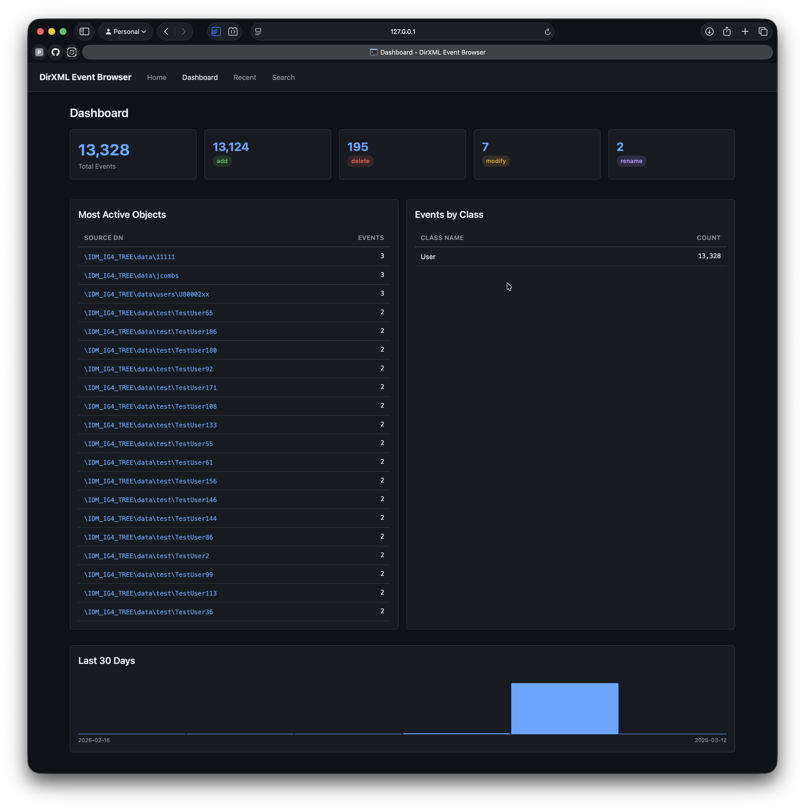
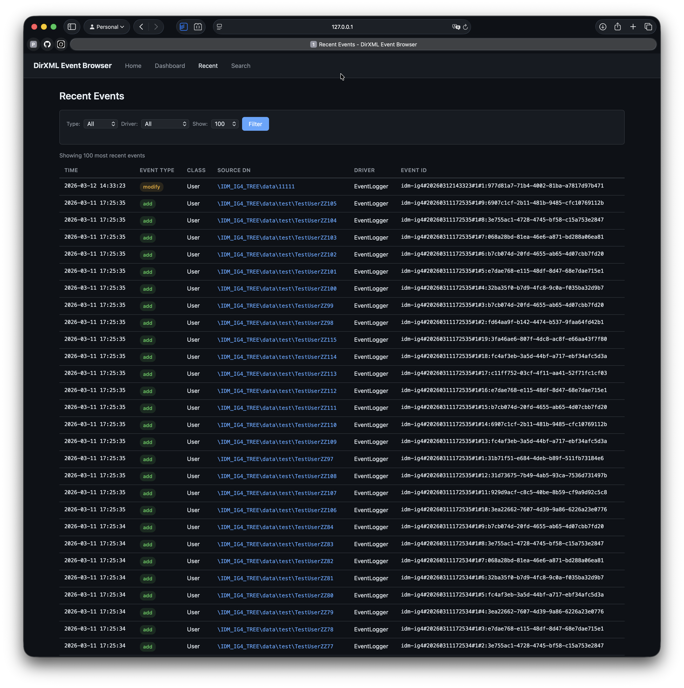

# DirXML Event Logger

A NetIQ Identity Manager driver that captures events from the subscriber channel and logs them to a PostgreSQL database, along with a Flask web UI for browsing and forensic analysis. While it may be useful, this is not a comprehensive auditing solution. It is very useful during driver development as it can capture sample events to be used for testing.

## Overview

The Event Logger driver sits on the subscriber channel of an Identity Manager driver set. Every event that passes through (add, modify, delete, sync, rename, move) is converted to JSON and written to a PostgreSQL table alongside the original XML. This gives you a searchable, queryable audit trail of all identity events.

The companion web UI provides a forensic investigation interface: search for any object by DN and see a complete timeline of every event that affected it, with diff views for modify events showing exactly what changed.





## Components

```
src/com/pointblue/idm/eventlogger/
  EventLoggerDriver.java     Main driver class (DriverShim, SubscriptionShim, PublicationShim)
  CommonImpl.java             Base class with XDS document utilities
  PolicyLogger.java           Standalone logger for policy input/output documents
  xds2json/
    BaseEventConverter.java   Abstract base for all XML-to-JSON converters
    AddEventConverter.java    Handles <add> events
    ModifyEventConverter.java Handles <modify> events
    DeleteEventConverter.java Handles <delete> events
    SyncEventConverter.java   Handles <sync> events
    RenameEventConverter.java Handles <rename> events
    MoveEventConverter.java   Handles <move> events
    JsonToXmlConverter.java   Reverse converter (JSON back to XML)
  offline/                    Test harnesses for offline development (IDE only)
test/                         Unit and database tests (mvn test)
idm-api-stubs/                Compile-only engine API stand-ins (never packaged)
pom.xml                       Maven build
web/
  app.py                      Flask web application
  requirements.txt            Python dependencies
  Dockerfile                  Web UI container image
  templates/                  Jinja2 templates
docker/
  compose.yml                 Web UI + optional PostgreSQL with pg_cron (--profile db)
  engine.example.yml          Mounting the jars into an engine container
  postgres/                   PostgreSQL + pg_cron image
  postgres-init/              First-start accounts and cleanup job for the bundled database
sql/
  CREATE jsonEvent.sql        Table and index DDL
  *.sql                       Example queries
EventLogger.xml               Designer driver export for import
```

## Database Setup

### 1. Create the database

```sql
CREATE DATABASE "idmEvent";
```

### 2. Create the table and indexes

Connect to the `idmEvent` database and run the DDL script:

```bash
psql -h localhost -U postgres -d idmEvent -f sql/CREATE\ jsonEvent.sql
```

This creates:

| Column | Type | Description |
|--------|------|-------------|
| `id` | `bigserial` PK | Row ID |
| `eventid` | `varchar` | DirXML event ID (e.g. `1714143050#2`). Unique among the driver's own rows; PolicyLogger can log the same event once per policy and stage |
| `classname` | `varchar` | Object class (e.g. `User`, `Group`) |
| `srcdn` | `varchar` | Source DN of the affected object |
| `srcentryid` | `varchar` | Source entry GUID |
| `eventtype` | `varchar` | Event type: add, modify, delete, sync, rename, move |
| `eventjson` | `jsonb` | Full event converted to JSON |
| `xmlevent` | `text` | Original XDS XML document (optional, controlled by `storeXML`) |
| `cachedtime` | `timestamptz` | Event timestamp |
| `srcdriver` | `varchar` | DN of the source driver that logged the event |
| `channel` | `varchar` | PolicyLogger rows: `subscriber` or `publisher`. NULL for the driver's own rows |
| `policy` | `varchar` | PolicyLogger rows: the policy name or DN as passed to `logEvent`. NULL for the driver's own rows |
| `stage` | `varchar` | PolicyLogger rows: `input` or `output`. NULL for the driver's own rows |
| `schemaversion` | `smallint` | Shape of `eventjson`: `1` for rows written before release 1.0.0 (or by older driver jars), `2` for current rows. The JSON also carries `"schemaVersion": 2` |

Indexes are created on `srcdn` and `REVERSE(srcdn)` with `text_pattern_ops` (subtree and DN-suffix `LIKE` queries under any collation), `(srcdn, cachedtime)` (object timelines), `cachedtime` (recent events, dashboard, date filters and purge jobs), `eventid`, and `(srcdriver, policy)` (filtering by driver and policy). The script is safe to re-run on an existing database: it only creates what is missing.

### Upgrading an existing database

Tables created before release 1.0.0 need the migration script. It adds the `id` primary key, the PolicyLogger columns and the `schemaversion` column, fills those columns for existing PolicyLogger rows from their JSON, and adds the new indexes. It is safe to run more than once:

```bash
psql -h localhost -U postgres -d idmEvent -f "sql/MIGRATE 2 policy columns.sql"
```

Adding the `id` column rewrites the table, so run it on a large table during a quiet period. Upgrade the database before deploying the new driver jar or web UI, since both use the new columns.

If the driver connects with an account that does not own the table, that account also needs the new sequence:

```sql
GRANT USAGE ON SEQUENCE dxmlevent_id_seq TO <driver_account>;
```

### 3. Create a read-only user for the web UI

The web UI should connect with a read-only database account to prevent accidental data modification:

```sql
CREATE USER eventlogger_reader WITH PASSWORD 'your_reader_password';
GRANT CONNECT ON DATABASE "idmEvent" TO eventlogger_reader;
GRANT USAGE ON SCHEMA public TO eventlogger_reader;
GRANT SELECT ON ALL TABLES IN SCHEMA public TO eventlogger_reader;
ALTER DEFAULT PRIVILEGES IN SCHEMA public GRANT SELECT ON TABLES TO eventlogger_reader;
```

## Driver Installation

### Getting the JAR

Download `dirxml-event-logger-<version>.jar` and `postgresql-<version>.jar` from the [GitHub releases](https://github.com/jcombs-pointblue/DIrXMLEventLogger/releases), or build them yourself.

### Building the JAR

Requires JDK 17 or newer and Maven 3.9. The jar is built as Java 8 bytecode, so it runs on any engine JVM.

```bash
mvn package
```

This produces `target/dirxml-event-logger-<version>.jar` and copies the PostgreSQL JDBC driver to `target/postgresql-<version>.jar`. After the first build has downloaded the dependencies, `mvn -o package` works offline.

The driver compiles against the Identity Manager driver API in one of two ways:

- **Real engine jars:** if `lib/dirxml.jar` exists, the build uses it. Copy it from an IDM install or point at another directory with `-Didm.lib=/path/to/jars`. The `lib/*.jar` files are gitignored, so they are never committed.
- **Stubs:** otherwise the build uses `idm-api-stubs/`, signature-only stand-ins for the seven API types the driver uses. CI and releases build this way.

Engine classes are never packaged in the jar, whichever way it was built. Building once with the real `dirxml.jar` confirms the stubs match the API.

### Deploying the JAR

1. Copy `dirxml-event-logger-<version>.jar` and `postgresql-<version>.jar` to the engine's driver classpath (typically `/opt/novell/eDirectory/lib/dirxml/classes/`).
2. Restart eDirectory (`ndsmanage stopall && ndsmanage startall`, or restart the engine container).
3. The driver writes `DirXML Event Logger version <version>` to the trace on startup, so you can confirm which build is loaded.

### Releasing

1. Set the new version in `pom.xml` and `EventLoggerDriver.VERSION` (the build fails if they differ), and move the `Unreleased` notes in `CHANGELOG.md` under the new version.
2. Tag and push: `git tag v<version> && git push origin v<version>`.
3. The Release workflow builds the jar, checks the tag matches the pom, and publishes a GitHub release with both jars attached, using the changelog entry as release notes.

### Importing the driver in Designer

1. Open NetIQ Identity Manager Designer.
2. Right-click on the driver set where you want to add the Event Logger.
3. Select **Import** and choose `EventLogger.xml` from the project root.
4. This creates a pre-configured driver object with the correct Java class name and default settings.
5.  Modify the driver filter to include the attributes ( or classes) you need. 

### Driver Configuration

The driver uses the standard Identity Manager authentication fields:

| Field | Purpose | Example |
|-------|---------|---------|
| **Authentication ID** | PostgreSQL username | `postgres` |
| **Authentication Context** | PostgreSQL host:port/database | `localhost:5432/idmEvent` |
| **Application Password** | PostgreSQL password | *(your password)* |

#### Driver Options

| Option | Type | Default | Description |
|--------|------|---------|-------------|
| `storeXML` | string | `true` | Set to `false` to skip storing the raw XML document (saves disk space). Keep `true` for development stores, see below |
| `tableName` | string | `public.dxmlevent` | Override the target table name |

**Keep `storeXML=true` on development and test stores.** The raw document in `xmlevent` is what the DirXML simulator replays as a test case: it is exactly what reached the driver, apart from masked passwords. A document rebuilt from `eventjson` loses the parts listed in [What the JSON does not keep](#rebuilding-xml-from-the-json), so cases built from it are marked as reconstructed and may not reproduce an issue. Turn it off only on a store kept for audit browsing, where disk space matters more than replay.

### How it works

1. The driver's `init()` method reads the authentication and option parameters, then validates the database connection. If the database is unreachable, the driver returns a fatal status and will not start.
2. On each subscriber channel event, `execute()` is called with the XDS document.
3. The XML is parsed to determine the event type, then converted to JSON by the appropriate converter.
4. The JSON and (optionally) raw XML are inserted into PostgreSQL via a reusable JDBC connection.
5. If the database becomes unavailable, the driver applies exponential backoff (1s, 2s, 4s, ... up to 5 minutes) before retrying, and returns `STATUS_RETRY` so the engine queues the event for redelivery.

### Password redaction

Passwords are masked with `***` before anything is converted or stored, so neither `eventjson` nor `xmlevent` ever holds one. Masked values:

- The text of any element whose name contains `password` (case-insensitive): `<password>`, `<old-password>`, the contents of `<modify-password>` and `<check-object-password>`, and password elements inside `<operation-data>`.
- Every value of an attribute whose name contains `password` (case-insensitive), such as `nspmDistributionPassword`.

Documents logged through PolicyLogger are masked the same way. DSTrace output at level 3 shows the masked document as well.

### Rebuilding XML from the JSON

`JsonToXmlConverter` turns a row's `eventjson` back into an XDS document, for rows stored with `storeXML=false`. Tests convert one document of each event type (add, modify, delete, sync, rename, move) to JSON and back, and check that the event element comes back with the same elements, attributes and text.

The rebuilt document is equivalent, not identical. **What the JSON does not keep:**

- **The envelope:** the `<nds>` attributes, `<source>`, any other elements in `<input>` besides the event, and comments and processing instructions. The rebuilt document always has `<nds dtdversion="4.0" ndsversion="8.x"><input>`.
- **Order:** the order of attributes, `<add-attr>`/`<modify-attr>` elements and `<operation-data>` children. The order of values within one attribute is kept.
- **Whitespace:** text is trimmed.
- **`<operation-data>`:** only the text of its direct children. Their attributes and any nested elements are lost, and repeated child names keep only the last value.
- **Repeats:** only the first `<association>` and `<password>` of the event.
- **Structured values:** component order and repeated component names.
- **Modify grouping:** several `<add-value>` or `<remove-value>` groups in one `<modify-attr>` come back as one of each, in the order `<remove-all-values>`, `<remove-value>`, `<add-value>`.
- **Unknown elements:** child elements a converter does not handle are dropped. Handled elements: `association`, `add-attr` (add, sync), `modify-attr` (modify), `password` (add, modify), `status` (sync), `new-name` (rename), `parent` (move) and `operation-data`.
- **Passwords:** stored as `***`, so a rebuilt document never carries the real password.

Rows with `schemaversion` 1 lose more. Their modify values were stored as plain text without `type` or `timestamp` (several values in one `<add-value>` were run together), rename events had no `new-name`, and a move's parent association was stored as text.

### Error handling

| SQL State | Behavior |
|-----------|----------|
| `23505` (duplicate key) | Returns error, event is skipped (already logged) |
| *(XML parse error)* | Returns error, event is skipped (a malformed document will never succeed) |
| `42P01`, `42703` (undefined table/column) | Returns fatal, requires admin fix |
| `28000` (invalid credentials) | Returns fatal |
| `08xxx` (connection errors) | Resets connection, applies backoff, retries |
| Other | Retries |

## Web UI

The web UI is a Flask application for browsing and searching the event database.

### Running with Docker (recommended)

`docker/compose.yml` runs the web UI and, optionally, a ready-to-use PostgreSQL. It works on Windows, macOS (Intel and Apple Silicon) and Linux with [Docker Desktop](https://www.docker.com/products/docker-desktop/), Docker Engine or Podman (`podman compose`).

1. Copy the example settings and replace every `change_me` value:

```bash
cd docker
cp .env.example .env
```

   `EVENTLOGGER_VERSION` picks the release. The web UI image and the engine jars are both taken from that release, so they always match.

2. Start the stack.

   **With the bundled database** (good for driver development and labs). Leave `DB_HOST=postgres`:

   ```bash
   docker compose --profile db up -d
   ```

   On first start the database is created with the event table, its indexes, and two accounts:

   | Account | Access | Used by |
   |---------|--------|---------|
   | `eventlogger_writer` (`WRITER_USER`) | SELECT, INSERT | The Event Logger driver |
   | `eventlogger_reader` (`DB_USER`) | SELECT only | The web UI and other readers |

   It also installs [pg_cron](https://github.com/citusdata/pg_cron) and schedules the [size-based cleanup](#size-based-cleanup). At `PURGE_SCHEDULE` (default 04:00 UTC daily), the oldest events are deleted until the table is under `EVENT_MAX_SIZE_MB` (default 1000).

   Point the driver at it: **Authentication ID** `eventlogger_writer`, **Authentication Context** `<docker-host>:5432/idmEvent`, **Application Password** the `WRITER_PASSWORD` value. Data is kept in the `pgdata` volume. Accounts and the cleanup job are only created on first start, so to change them later use SQL, or delete the volume (`docker compose --profile db down -v`, which deletes all events).

   **With an existing database.** Set `DB_HOST` to your PostgreSQL server and create the read-only user as shown in [Database Setup](#3-create-a-read-only-user-for-the-web-ui), then:

   ```bash
   docker compose up -d
   ```

3. Open http://localhost:5000 (change the port with `WEB_PORT`).

`docker compose pull` fetches the published web image (`linux/amd64` and `linux/arm64`, from GitHub Container Registry). `docker compose up -d --build` builds it from source instead. The bundled PostgreSQL image is always built locally, since it is `postgres:17` plus pg_cron. To stop: `docker compose --profile db down`.

The web container runs under gunicorn as a non-root user and exposes `/health` for health checks.

### Putting the driver on an engine container's classpath

If your Identity Manager engine runs in a container, mount the two jars into it:

1. Download the jars of release `EVENTLOGGER_VERSION` into `docker/engine-jars/`:

   ```bash
   docker compose run --rm fetch-jars
   ```

2. Add the two file mounts from [`docker/engine.example.yml`](docker/engine.example.yml) to your engine container's service. Mount the jar files, not the directory: mounting over `/opt/novell/eDirectory/lib/dirxml/classes/` would hide the engine's own jars.

   ```yaml
   volumes:
     - ./engine-jars/dirxml-event-logger-${EVENTLOGGER_VERSION}.jar:/opt/novell/eDirectory/lib/dirxml/classes/dirxml-event-logger.jar:ro
     - ./engine-jars/postgresql.jar:/opt/novell/eDirectory/lib/dirxml/classes/postgresql.jar:ro
   ```

3. Restart the engine container (`docker compose restart <engine-service>`) so the JVM loads them, and check the trace for `DirXML Event Logger version <version>`.

The engine image itself is not part of this project.

### Running with Python

If you prefer to run without Docker:

```bash
cd web
python3 -m pip install -r requirements.txt
```

Start the application with your database credentials:

```bash
DB_HOST=localhost \
DB_PORT=5432 \
DB_NAME=idmEvent \
DB_USER=eventlogger_reader \
DB_PASSWORD=your_reader_password \
python3 app.py
```

`python3 app.py` starts Flask's development server on 127.0.0.1 only. Set `FLASK_DEBUG=1` to enable the debugger, and never do that on a reachable host since it allows running code on the server. For a shared deployment, use the container or run `gunicorn --bind 0.0.0.0:5000 app:app`.

Then open http://localhost:5000.

**Important:** Use the read-only database account (`eventlogger_reader`) for the web UI, not the driver's write account. The UI only needs SELECT access and should not have the ability to modify event data.

#### Environment variables

| Variable | Default | Description |
|----------|---------|-------------|
| `DB_HOST` | `localhost` | PostgreSQL host |
| `DB_PORT` | `5432` | PostgreSQL port |
| `DB_NAME` | `idmEvent` | Database name |
| `DB_USER` | `postgres` | Database user |
| `DB_PASSWORD` | *(empty)* | Database password |
| `TABLE_NAME` | `public.dxmlevent` | Table name (must match driver config) |

### Pages

| Page | URL | Description |
|------|-----|-------------|
| **Home** | `/` | DN autocomplete search to find objects |
| **Timeline** | `/timeline?srcdn=...` | Chronological event history for an object, filterable by event type, class name, and date range |
| **Event Detail** | `/event?row=...` | Full JSON and XML view for a single event, with modify diff table showing old/new values and prev/next navigation |
| **Recent** | `/recent` | Most recent events across all objects (default 100), filterable by type and driver |
| **Search** | `/search` | Full-text search across all event JSON payloads with filters |
| **Dashboard** | `/stats` | Event counts by type and class, most active objects, 30-day activity chart |
| **CSV Export** | `/export/timeline?srcdn=...` | Download an object's complete event history as CSV |

### Forensic workflows

**"What happened to this user?"** — Go to Home, type part of the DN, select it, view the full timeline. Filter by date range to narrow down an incident window.

**"What changed on this date?"** — Use Search with a date range filter. Click any result to see full detail, or click the DN to see that object's complete history.

**"What attributes were modified?"** — Click any modify event in a timeline. The Event Detail page shows a diff table with the attribute name, old value, and new value.

**"Find all events touching a specific value"** — Use Search to query across all JSON payloads. For example, search for an email address to find every event that set or removed it.

## PolicyLogger — Logging Events from Other Drivers

The Event Logger driver only captures events on its own subscriber channel. If you want to log events from *other* drivers — for example, to capture what an AD driver or SAP driver is processing — you can use PolicyLogger from an ECMAScript policy on those drivers.

### How it works

When the EventLoggerDriver starts, it automatically registers itself with the PolicyLogger static registry. Policies on any other driver in the same JVM can then call `PolicyLogger.logEvent()` to send their current XDS document to the Event Logger's database — no database credentials needed in the policy code.

### Setup

1. Deploy the Event Logger jar and the PostgreSQL JDBC driver to the Identity Manager classpath (see [Deploying the JAR](#deploying-the-jar)).
2. Start the EventLoggerDriver. It registers itself automatically.
3. Add an ECMAScript policy action to the driver whose events you want to capture.

### ECMAScript policy example

Add this as an ECMAScript action in a policy on the driver you want to log events from (e.g., your AD driver, LDAP driver, etc.):

```javascript
var PolicyLogger = Packages.com.pointblue.idm.eventlogger.PolicyLogger;

// DN of the EventLoggerDriver to log through
var eventLoggerDN = "\\TREENAME\\system\\driverset\\EventLogger";

// DN of THIS driver (the one whose policy is running)
var thisDriverDN = "\\TREENAME\\system\\driverset\\ActiveDirectory";

// Get the current operation document via XPath
var xmlString = XPATH.get("/");

// Log the event — returns true on success, false on error
PolicyLogger.logEvent(eventLoggerDN, thisDriverDN, "sub", "AD-Sub-ETP", xmlString);

// Or say whether this is the document going into the policy or coming out of it
PolicyLogger.logEvent(eventLoggerDN, thisDriverDN, "sub", "AD-Sub-ETP", "output", xmlString);
```

Place the policy on whichever channel and at whichever policy point you want to capture. For example, placing it on the subscriber Event Transformation Policy of your AD driver would log every event the AD driver processes on its subscriber channel.

**Parameters:**

| Parameter | Description |
|-----------|-------------|
| `eventLoggerDN` | Full DN of the EventLoggerDriver instance to log through |
| `thisDriverDN` | Full DN of the driver whose policy is calling this method (stored in the `srcdriver` column) |
| `channel` | `"subscriber"` or `"publisher"` (`"sub"` and `"pub"` are accepted). Stored in the `channel` column |
| `policyDN` | Name or DN of the calling policy. Stored as given in the `policy` column |
| `stage` | Optional: `"input"` or `"output"`, whether the document is the policy's input or its result. Defaults to `"input"`. Stored in the `stage` column |
| `xmlString` | The current XDS document as a string (use `XPATH.get("/")`) |

The method returns `boolean` — `true` if the event was logged, `false` if the EventLoggerDriver is not running or an error occurred. Errors are traced but never thrown, so the calling driver's policy execution is not interrupted.

### What gets stored

Events logged through PolicyLogger are written to the same table as the Event Logger driver's own events, with the `channel`, `policy` and `stage` columns filled in. Rows written by the Event Logger driver itself leave those three columns NULL. The same engine event can be logged at several policies and stages; each call adds a row.

For older readers, the JSON also carries `logged-by-policy` (the policy name) and `logged-channel` (the channel as passed).

The `srcdriver` column is set to the calling driver's DN (the `thisDriverDN` parameter). This lets you distinguish which driver an event came from and filter by source driver in the web UI. Events captured directly by the EventLoggerDriver on its own subscriber channel will have `srcdriver` set to the EventLoggerDriver's own DN.

### Error handling and retries

`logEvent()` returns `false` if the event could not be logged. This happens when:

- The EventLoggerDriver is not running (not registered in the PolicyLogger registry)
- The database connection is down
- The XML could not be parsed or converted

Errors are traced but never thrown, so the calling driver's policy execution continues normally. By default, a failed log is silently dropped.

If you want to handle failures, check the return value. The simplest approach is fire-and-forget:

```javascript
// Fire and forget — event is silently dropped on failure
PolicyLogger.logEvent(eventLoggerDN, thisDriverDN, "sub", "AD-Sub-ETP", xmlString);
```

If event logging is important but not critical, you can log a warning:

```javascript
var success = PolicyLogger.logEvent(eventLoggerDN, thisDriverDN, "sub", "AD-Sub-ETP", xmlString);
if (!success) {
    java.lang.System.out.println("WARNING: Failed to log event to Event Logger");
}
```

If event logging is critical and you want the engine to retry the event, return a retry status. This will cause the IDM engine to requeue the event on the calling driver's subscriber channel, and the policy will fire again on the next attempt:

```javascript
var success = PolicyLogger.logEvent(eventLoggerDN, thisDriverDN, "sub", "AD-Sub-ETP", xmlString);
if (!success) {
    status.setLevel(StatusLevel.RETRY);
    status.setMessage("Event Logger unavailable, retrying");
}
```

**Caution:** Using retry will stall the calling driver's event processing until the Event Logger becomes available. All queued events on that driver will back up until the retry succeeds. Only use this if logging is critical enough to block the driver over.

### Multiple Event Logger drivers

If you run more than one EventLoggerDriver (e.g., logging to different databases), each registers separately. Policy code references the DN of whichever Event Logger instance it wants to log through.

## Useful PostgreSQL Queries

Find events for a DN subtree. DNs contain backslashes, which are also `LIKE`'s escape character, so turn escaping off with `ESCAPE ''`. End the container with `\` so `\users` does not also match `\users2`:

```sql
SELECT * FROM dxmlevent
WHERE srcdn LIKE '\novell\Users\' || '%' ESCAPE ''
ORDER BY cachedtime;
```

Find an object by the end of its DN (uses the reverse index):

```sql
SELECT * FROM dxmlevent
WHERE reverse(srcdn) LIKE reverse('%' || '\Users\jdoe') ESCAPE ''
ORDER BY cachedtime;
```

[docs/store.md](docs/store.md) lists every column, the JSON shape of each event type, and the query patterns for programs that read the store.

Find all events where a specific attribute was modified:

```sql
SELECT * FROM dxmlevent
WHERE eventtype = 'modify'
  AND eventjson -> 'attributes' ? 'mail'
ORDER BY cachedtime;
```

Search for a specific value in event payloads:

```sql
SELECT * FROM dxmlevent
WHERE eventjson::text ILIKE '%jdoe@example.com%';
```

Get database size:

```sql
SELECT pg_size_pretty(pg_database_size('idmEvent'));
```

## Event Table Maintenance

The event table will grow indefinitely. To automatically purge old events, use [pg_cron](https://github.com/citusdata/pg_cron) to schedule a nightly cleanup job.

### Installing pg_cron

pg_cron is available as a package on most PostgreSQL distributions. On Debian/Ubuntu:

```bash
sudo apt install postgresql-16-cron
```

Add it to `postgresql.conf`:

```
shared_preload_libraries = 'pg_cron'
cron.database_name = 'idmEvent'
```

Restart PostgreSQL, then enable the extension:

```sql
CREATE EXTENSION pg_cron;
```

### Scheduling a cleanup job

A simple `DELETE` that removes all events older than 30 days:

```sql
SELECT cron.schedule(
    'purge-old-events',
    '0 3 * * *',  -- every day at 3:00 AM
    $$DELETE FROM dxmlevent WHERE cachedtime < now() - interval '30 days'$$
);
```

### Batched deletes for large tables

If the table is large, a single `DELETE` can hold locks and generate WAL traffic for an extended period. Use a batched approach that deletes in chunks of 10,000 rows with a short pause between batches. Create this function in the `idmEvent` database:

```sql
CREATE OR REPLACE FUNCTION purge_old_events(
    retention_interval interval DEFAULT interval '30 days',
    batch_size int DEFAULT 10000,
    pause_ms int DEFAULT 100
)
RETURNS bigint LANGUAGE plpgsql AS $$
DECLARE
    total_deleted bigint := 0;
    batch_deleted bigint;
BEGIN
    LOOP
        DELETE FROM dxmlevent
        WHERE id IN (
            SELECT id FROM dxmlevent
            WHERE cachedtime < now() - retention_interval
            LIMIT batch_size
        );
        GET DIAGNOSTICS batch_deleted = ROW_COUNT;
        total_deleted := total_deleted + batch_deleted;
        EXIT WHEN batch_deleted = 0;
        PERFORM pg_sleep(pause_ms / 1000.0);
    END LOOP;
    RETURN total_deleted;
END;
$$;
```

Then schedule it with pg_cron:

```sql
SELECT cron.schedule(
    'purge-old-events-batched',
    '0 3 * * *',
    $$SELECT purge_old_events(interval '30 days', 10000, 100)$$
);
```

### Size-based cleanup

Instead of (or in addition to) age-based purging, you can trigger cleanup only when the table exceeds a size threshold. [`sql/purge_events_by_size.sql`](sql/purge_events_by_size.sql) creates `purge_events_by_size(max_size_mb, batch_size, pause_ms)`. It checks the table size first, then deletes the oldest events in batches until the table is under the target size. Install it in the `idmEvent` database:

```bash
psql -d idmEvent -f sql/purge_events_by_size.sql
```

The bundled database in `docker/compose.yml` installs and schedules it automatically.

Schedule it to check daily — it will only delete if the table exceeds the threshold (1 GB in this example):

```sql
SELECT cron.schedule(
    'purge-events-by-size',
    '0 4 * * *',  -- every day at 4:00 AM
    $$SELECT purge_events_by_size(1000, 10000, 100)$$
);
```

> **Note:** `pg_total_relation_size` includes indexes and TOAST data. After large deletes, the disk space is not returned to the OS until you run `VACUUM FULL` or let autovacuum reclaim it. The table will appear to shrink to new queries immediately, but the on-disk file size may lag behind.

### Managing jobs

```sql
-- List scheduled jobs
SELECT * FROM cron.job;

-- View recent job run history
SELECT * FROM cron.job_run_details ORDER BY start_time DESC LIMIT 10;

-- Remove a job
SELECT cron.unschedule('purge-old-events-batched');
```

## License

Copyright Point Blue Technology. This code is public domain and may be used in any way you like.
